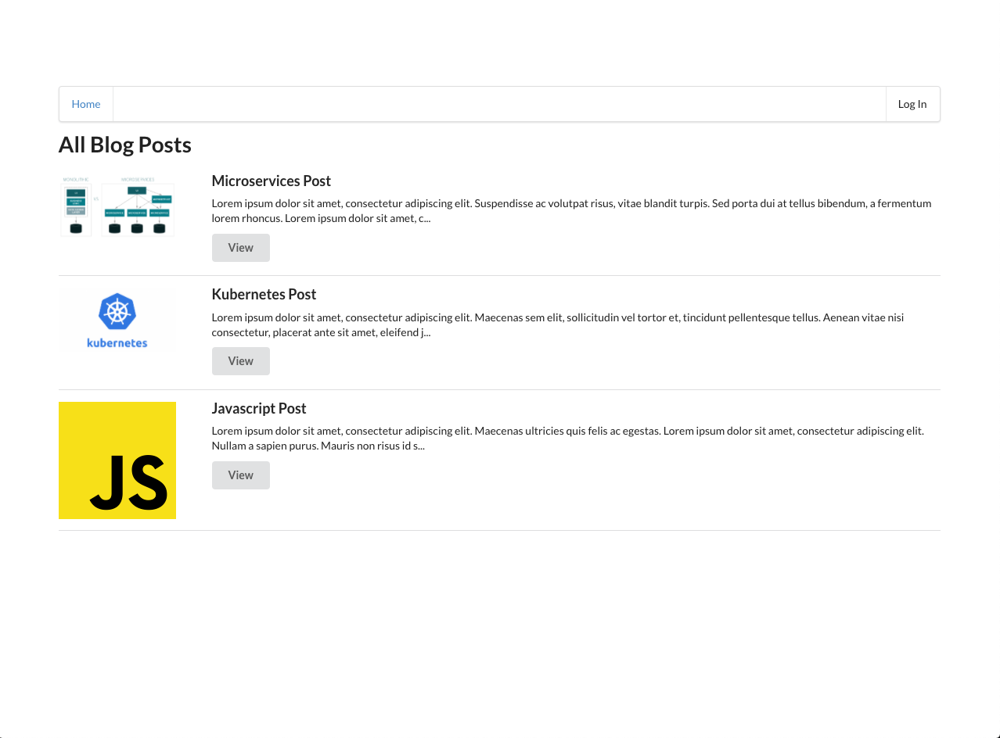
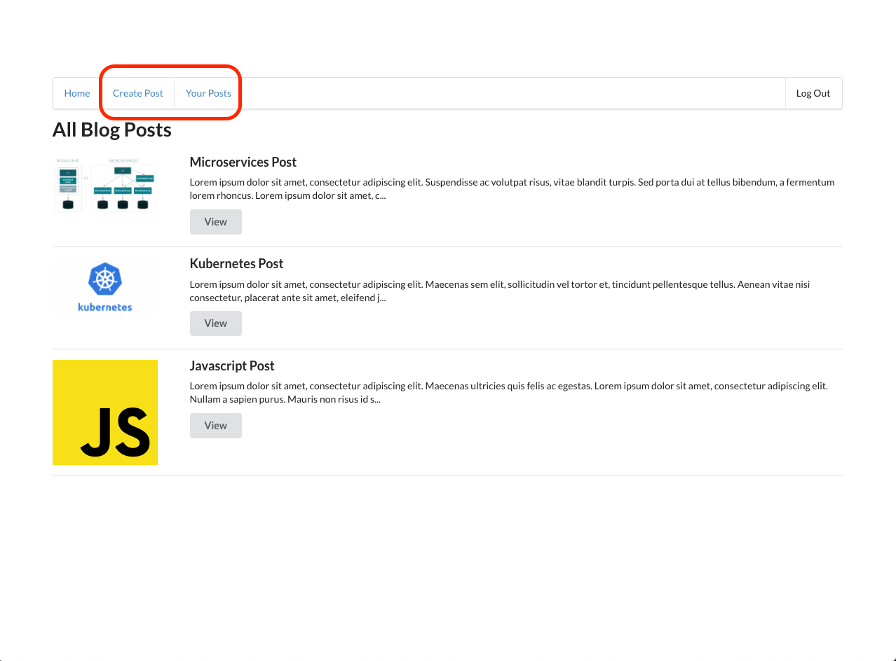
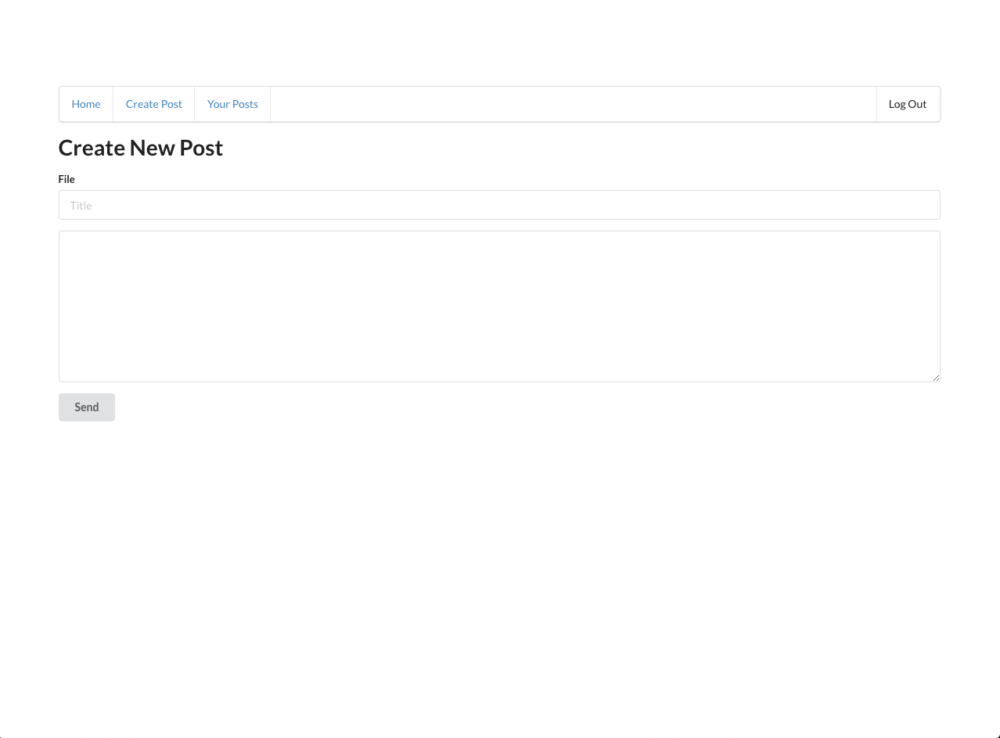
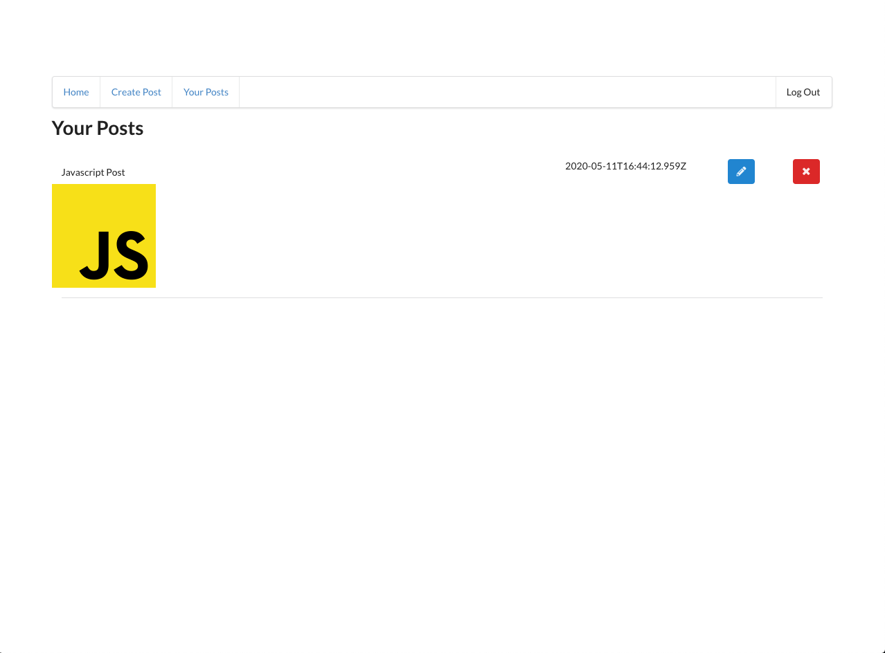
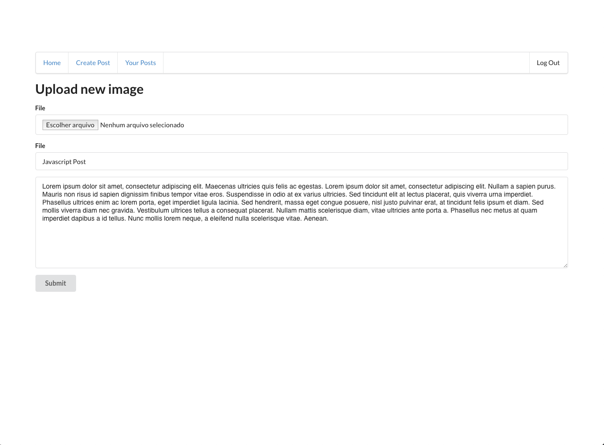

# Serverless Blog App - Udacity Final Project

This is a serverless application developed for the Udacity Cloud Developer Nanodegree Program.

## Getting Started

### Tools

- [Nodej.s 12](https://nodejs.org/dist/v12.16.3/node-v12.16.3.pkg)
- [Serverless Framework](https://www.serverless.com/framework/docs/getting-started/)

### Deployment

#### Backend

Go to backend folder:

```
cd $PROJECT_HOME/backend
```

Execute the serverless cli deployment command:

```
sls deploy -v --stage dev --region us-east-1
```

#### Frontend

Go to client folder:

```
cd $PROJECT_HOME/frontend
```

Install dependencies:

```
npm install
```

Execute the npm script:

```
npm run start
```

##Functionalities

### Initial Page

This page shows all posts of all users of the app. Authentication is not necessary for this page.



### Initial Page logged

When you log in, you will able to see another two options on the menu.



### Create Page

Page to create a new post



### Your Posts Page

This page show all posts created by the logged user.



### Edit Post Page

This page upload or edit the fields of a post.


